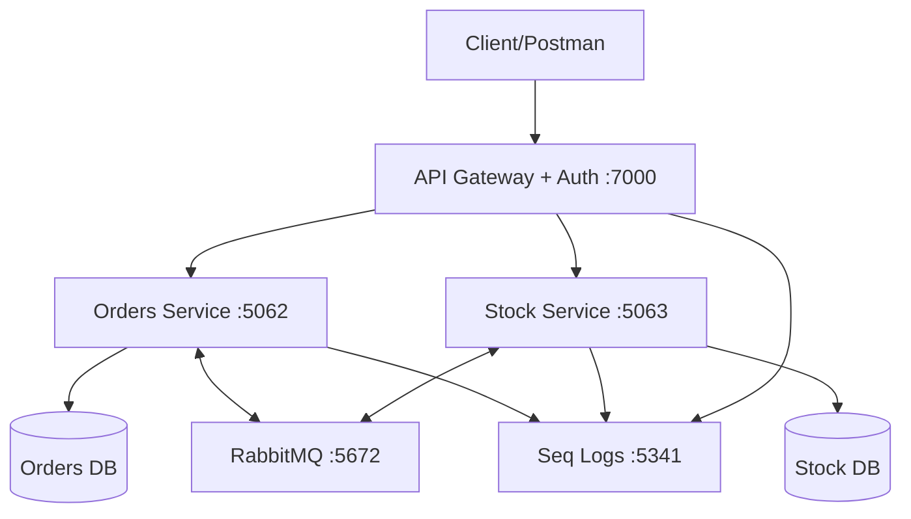

# AvanadeAwesome Shop - Microservices E-Commerce

## Arquitetura



## Tecnologias

- **.NET 9** - Framework principal
- **Entity Framework Core** - ORM
- **SQL Server** - Banco de dados
- **RabbitMQ** - Message broker
- **Ocelot** - API Gateway
- **JWT** - Autenticação
- **Serilog + Seq** - Logging
- **Docker** - Containerização

## Como Executar

### 1. Pré-requisitos

- Docker Desktop
- .NET 9 SDK
- Visual Studio 2022 / VS Code

### 2. Iniciar Infrastructure

```bash
# Na pasta src/
docker-compose up -d
```

### 3. Aplicar Migrations

```bash
# Orders Service
cd AvanadeAwesomeShop.Service.Orders/AvanadeAwesomeShop.Service.Orders.API
dotnet ef database update

# Stock Service
cd ../../AvanadeAwesomeShop.Service.Stock/AvanadeAwesomeShop.Service.Stock.API
dotnet ef database update
```

### 4. Executar Services

```bash
# Terminal 1 - Stock Service
cd AvanadeAwesomeShop.Service.Stock/AvanadeAwesomeShop.Service.Stock.API
dotnet run

# Terminal 2 - Orders Service
cd AvanadeAwesomeShop.Service.Orders/AvanadeAwesomeShop.Service.Orders.API
dotnet run

# Terminal 3 - API Gateway
cd AvanadeAwesomeShop.ApiGateway
dotnet run
```

## Autenticação

### Usuários Disponíveis:

| Username | Password   | Role    |
| -------- | ---------- | ------- |
| admin    | admin123   | Admin   |
| manager  | manager123 | Manager |
| user     | user123    | User    |

### Login:

```http
POST http://localhost:7000/v1/auth/login
Content-Type: application/json

{
  "username": "admin",
  "password": "admin123"
}
```

## Endpoints

### Products (via Gateway)

- `GET /v1/products` - Listar produtos (All roles)
- `POST /v1/products` - Criar produto (Admin/Manager)
- `GET /v1/products/{id}` - Produto específico (Admin/Manager)

### Orders (via Gateway)

- `GET /v1/orders` - Listar pedidos (All roles)
- `POST /v1/orders` - Criar pedido (All roles)
- `GET /v1/orders/{id}` - Pedido específico (Admin/Manager)

### Customers (via Gateway)

- `GET /v1/customers` - Listar clientes (Admin/Manager)
- `POST /v1/customers` - Criar cliente (All roles)

## Monitoramento

- **Seq Logs**: http://localhost:5341 (admin/admin123)
- **RabbitMQ Management**: http://localhost:15672 (guest/guest)

## Arquitetura de Segurança

- **API Gateway**: Autenticação JWT centralizada
- **Authorization**: Role-based access control
- **Audit Logs**: Tentativas de login e acessos
- **Hash Passwords**

## Event-Driven Architecture

1. **Order Created** → Valida estoque via HTTP
2. **Stock Validation** → Confirma/Cancela pedido
3. **Domain Events**
4. **RabbitMQ** → Message broker confiável

## Testando

Use Postman ou similar:

1. **Login** → Obter token JWT
2. **Headers** → `Authorization: Bearer {token}`
3. **Testar endpoints** conforme roles

---
